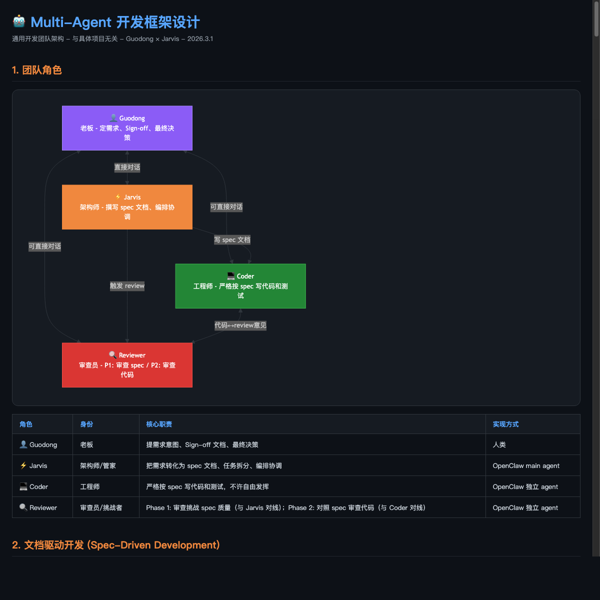
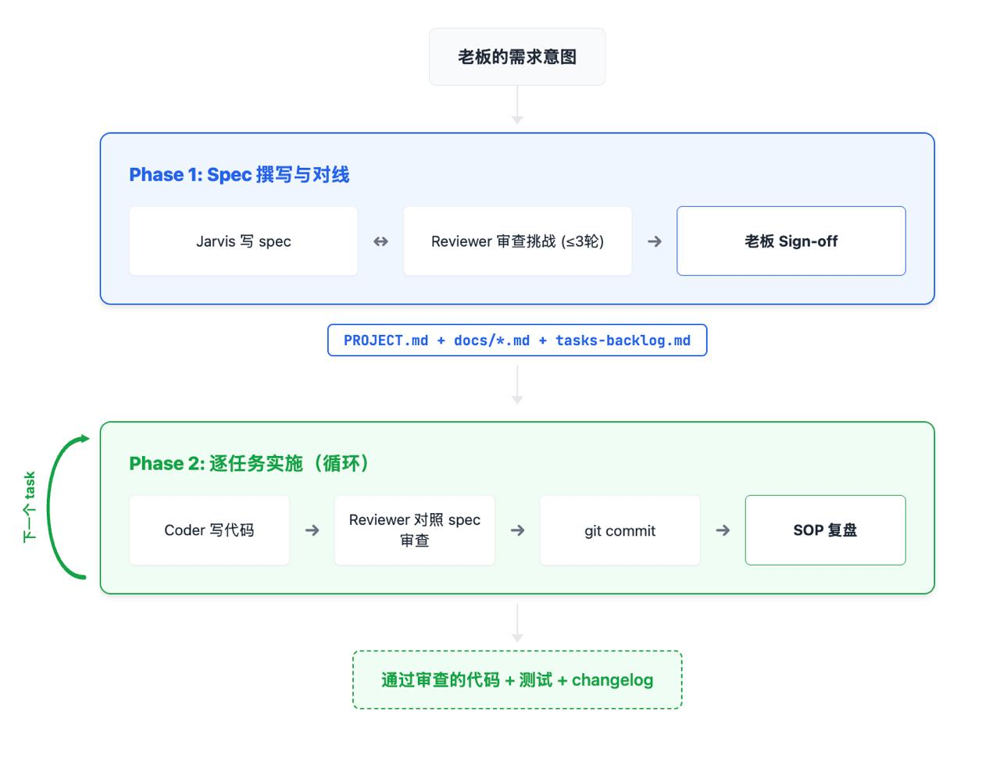

> *"Perfect is the enemy of good."* - Voltaire

# 用 AI 设计 AI 开发框架：一次多 Agent 协作的实践记录

> 2026年3月1日，我花了一整天，通过 OpenClaw 与三个 AI（Claude、Gemini、另一个 LLM）协作，设计了一套多 Agent 软件开发框架。这篇文章记录这个过程：参考了什么、做了哪些决策、踩了什么坑。

## 背景：两个想法碰到一起了

前几天我在公众号翻译了 Redis 缔造者 Antirez 的文章《不要陷入"反 AI"的狂热陷阱》[1]，其中他说："写代码已不再是必需的了，弄清楚'要做什么'以及'如何去做'变得有趣得多。"这篇文章让我一直在思考：在 AI 重塑编程方式的时代，作为程序员，怎么找到新的工作模式？

春节以来，我一直在把玩 OpenClaw，想了解多 Agent 系统是怎么工作的，以及如何用它来进行更快捷的项目开发。这是第一个出发点。

同时，我有一些个人兴趣项目搁置多年，比如 2017 年写的量化交易项目 ai4stocks（基于 John Carter 的 TTM 策略体系），7 年没更新了。借助 AI 的能力，把这些项目重新拾起来 - 这是第二个出发点。

没想到这两个想法最后碰到一起了：要用多 Agent 重启 ai4stocks，首先得回答**多个 AI Agent 怎么协作开发一个软件项目？**

市面上有 MetaGPT、AutoGen、CrewAI 这些框架，但它们解决的是"怎么让 Agent 跑起来"，不是"怎么让 Agent 写出靠谱的代码"。我需要的是一套开发流程和规范，不是另一个运行框架。

于是两个出发点协同成了一个：设计一套多 Agent 开发框架，然后用它来重启 ai4stocks。这就有了这一整天的探索。

## 起步：从零对聊

框架的第一版没有参考任何外部文章，就是我和 Jarvis 纯聊出来的。Jarvis 是我给 OpenClaw 助手起的名字，背后的大模型是 Claude Opus 4.6。

起点是我让 Jarvis 分析 GitHub 上一个 7 年没更新的量化交易项目 ai4stocks。分析完现有代码和技术栈后，我问：怎么用多 Agent 重启？

Jarvis 先设计了日常运行架构 - 3 个 Agent（分析、风控、报告）负责每天收盘后跑策略。然后我提出：开发阶段也要用 Agent，不能只有运行时用。于是加了 Coder + Reviewer 两个开发角色。

**再然后我意识到：开发框架应该是通用的，不应该绑定在 ai4stocks 这一个项目上。换个项目也能用同一套 Coder + Reviewer。这就把框架设计从项目文档里独立出来了。**

整个过程就是我出方向和约束，Jarvis 出结构和细节，我 review 和调整，来回几轮。

第一版框架粗糙但骨架完整 - 4 个角色（老板、Jarvis 架构师、Coder 工程师、Reviewer 审查员）、消息+黑板通信、任务循环、git 回滚。后面引入的外部参考都是在这个骨架上做加法和修正。

## 过程本身：用 AI review AI 的设计

> AI 框架的第一个版本，注定要用"非 AI 框架"的方式生产出来。这就是 bootstrapping。

这次设计本身就是一次多 Agent 协作的实践 - 只不过 Agent 是我手动调度的：

1. **Claude (Jarvis)**：主力，负责写框架文档、执行修改
2. **另一个 LLM**：扮演 challenger，提出 6 个 challenge（spec 质量、利益冲突、串行限制等），直接推动了两阶段模型的诞生
3. **Gemini**：最后做了一轮完整 review，提出了 10 个问题

三个 AI 各有特点：
- Claude 擅长执行和细化，给它方向它能快速产出结构化文档
- Challenger LLM 擅长找漏洞，它提出的"Reviewer 利益冲突"问题我完全没想到
- Gemini 的 review 偏工程化，有些建议过度工程（如"定义 FILE_BACKLOG 变量名"），但也有好点子（token 爆炸问题）

有意思的是，Gemini 给出的 🔴"必须修"里，有一半被我和 Claude 判断为"过早优化"直接 skip 了。AI reviewer 倾向于穷举所有可能的问题，但不是每个问题都值得现在解决。**框架设计需要克制 - 解决当下的问题，预留未来的空间，不要试图一次搞定所有事。**

### Bootstrapping：交叉编译的类比

回过头看，这个过程有一种熟悉感 - 就像第一次在新架构上启动软件。

你要在 RISC-V 上跑 Linux，但 RISC-V 上还没有编译器。所以你先在 x86 上用交叉编译器编译出 RISC-V 的工具链和内核。等 RISC-V 能跑了，再用它自己编译自己 - self-hosting。

这次做的事情完全一样：我要一个多 Agent 自动协作的开发框架，但框架还不存在，没法用它自己来开发自己。所以我手动当 orchestrator，调度三个 AI 来"交叉编译"出这个框架的第一个版本。等框架跑起来，Coder + Reviewer 就能在框架内迭代框架本身的 SOP - self-hosting。

## 参考来源

在第一版的基础上，后续引入了几个外部参考来验证和补充设计。

**1. 自己的工程经验**

20 年 Linux 内核开发积累的 code review 文化、upstream patch 流程、以及在 Linaro 带团队的经验。仔细想想，给内核社区发 patch 和给 Agent 下指令有本质的相似：你和 reviewer 是两个不同的个体，通过 commit message、cover letter 和 patch 本身进行交流。现在在 AI 时代，Agent 之间的交流目前也只是文字。所以要用好文字的力量 - 这个概念是一脉相通的。多年书写 commit message 和 cover letter 训练了我"先把问题和方案想清楚再动手"的思维方式，这种习惯自然地延伸到了框架的 Spec-Driven 设计中。

**2. Gemini 多 Agent 架构调研报告**

2月22日（正月初六），我用 Gemini Pro 的 Deep Research 模式生成的一份多 Agent 架构调研报告，对 CrewAI、AutoGen、LangGraph、MetaGPT、ChatDev 做了横向对比。如果用军事打比方，这份报告就是**侦察报告** - 告诉你战场地形，别人怎么打的，哪里有坑：

- 大多数框架关注"运行时编排"，对"开发质量保证"着墨不多 - 说明我在做的事有差异化价值

**3. Antirez《不要陷入"反 AI"的狂热陷阱》**

Redis 缔造者 Antirez 的文章（原文 [2]），我前几天在公众号「Docular嘚吧嘚」做了翻译和评论 [1]。他的一个核心观点直接影响了框架设计："你能获得的成功程度取决于你将问题构建成心智模型并传达给 LLM 的能力" - 这让我能沉下心来，在让 AI 动手写代码之前，先坐冷板凳把问题想清楚，想清楚了再放行。

**4. 阿里无岳《从传统编程转向大模型编程》[3]**

这篇文章虽然被标为 AI 生成，但其中的内容我相信来自作者的实战。如果说 Gemini 报告是侦察报告，这篇就是**战术手册** - 具体的战术动作，拿来就能用：

- **RL Lite（SOP 自我进化）**：补充了"验收流程本身"这一层，我的第一版只有代码验收
- **最后 10% 陷阱 / 代码催眠**：补充了两个风险点，作为防御性规则写入了框架
- **Auto-Flight Recorder**：强化了 changelog 的重要性，推动了 Based on 字段的加入

## 框架设计：关键决策

最终产出是一份 HTML 文档，定义了 4 个角色（老板/人类、Jarvis 架构师、Coder 工程师、Reviewer 审查员）、2 个阶段、11 条设计决策。

以下是几个最重要的决策和背后的思考。

### 决策 1：两阶段模型

这是整个框架最核心的设计。

**Phase 1（一次性）**：Jarvis（架构师 Agent）写 spec → Reviewer Agent 审查挑战 → 来回对线 → 老板 sign-off

**Phase 2（逐任务循环）**：Jarvis 派发 task → Coder Agent 写代码 → Reviewer 审查代码

为什么要分两阶段？因为 **garbage spec 会导致 garbage code**。如果 spec 本身质量不行，Coder 写得再好也没用，Reviewer 审得再仔细也是审一份有问题的实现。

Phase 1 的 spec 对线，保证了在任何人写代码之前，需求和设计就已经经过了对抗性审查。Reviewer 在这个阶段深度理解 spec 的每个细节，所以到 Phase 2 审代码时更快更准 - 它已经跟 spec 打过架了。

这个设计是在和另一个 LLM 讨论时成型的。最初的方案是每个 task 都走一遍 spec review，那个 LLM 指出这会增加大量延迟。改成"Phase 1 一次性对线 + Phase 2 逐任务实施"后，spec 审查的成本被摊平了。

### 决策 2：Reviewer 的利益冲突和干净 Session

> 💡 **花絮**：这是整个设计过程中最出乎我意料的发现 - 不是我想到的，是另一个 LLM 在扮演 challenger 时提出的。它甚至让我感受到了一种人性化的 AI 思维：AI 也会维护自己的"沉没成本"。

两阶段模型引入了一个微妙问题：Reviewer 在 Phase 1 签字认可了 spec，Phase 2 又要基于同一份 spec 审代码。如果 Phase 2 中发现 spec 有缺陷，Reviewer 等于承认自己 Phase 1 审漏了。

人或 AI 都有"沉没成本"倾向 - 倾向于维护自己签过字的东西。

解决方案是两层隔离：
- Phase 2 触发 Reviewer 时用**干净 session**，不带 Phase 1 的对话历史
- Reviewer 的 MEMORY.md **不记录 spec 审查结论**（如"模块 X 的 spec 我审过了没问题"），只记录通用教训

这样 Phase 2 的 Reviewer 实质上是一个"没参与过 Phase 1"的审查者，对 spec 没有感情包袱。

### 决策 3：Changelog 必须标注 Based on

无岳文章中的一个原则：所有 ChangeLog 必须注明依据的文档版本/文件名。

这解决了一个关键的溯源问题：代码和文档不一致时，到底是"文档改了没同步代码"还是"AI 幻觉"？没有 Based on 字段，这两个原因无法区分。

我们把 changelog 格式定为：**Based on（哪个 spec）→ Who → Why（重点）→ What（简略）→ Risk**。没有 Based on 的条目是危险信号，违反 No Doc, No Code 原则。

### 决策 4：SOUL.md 分区 + 治理

Agent 的行为规则写在 SOUL.md 里。每次复盘可能产生新规则，但规则积累过多会导致"过拟合" - 无岳文章提到过这个陷阱：因为一次特殊情况写了条极端规则，后续任务全卡死。

解决方案是把 SOUL.md 分两个区：
- **Core Principles**：稳定不动，定义角色本质
- **Learned Rules**：从复盘中积累，可快速迭代，但定期修剪

治理规则：
- Coder 和 Reviewer 永远不改自己的 SOUL.md，只能向 Jarvis 提建议
- Jarvis 执行修改：小改直接改，大改（会改变 Agent 下个 task 的行为的）须老板审批
- 老板定期 review Learned Rules，修剪过时规则

"大小改"的判断标准用了一个简洁的 heuristic：**如果这个改动会导致 Agent 在下一个 task 中做法不同（不只是理解更清楚），就是大改。**

### 决策 5：先串行，后并行

当前框架只支持串行 - 一次一个 task。这是有意为之：1 个 Coder + 1 个 Reviewer，并行了也是假并行，context switching 反而更乱。

但在框架里预留了并行扩展方案（`task.md` 变成 `tasks/` 目录），等串行流程验证通过后再启用。

### 其他决策

- **砍掉 status.md**：原本有 tasks-backlog.md 和 status.md 两个文件追踪进度，必然 out of sync。合并为一个文件，tasks-backlog.md 是唯一进度 source of truth
- **task.md "技术方案"改名"实施步骤"**：避免和 docs/*.md 的模块 spec 内容重复
- **review.md 按轮次追加**：每轮新增 Round 区块，不覆盖历史，Coder 能看到哪些 issue 还 open
- **Phase 2 改 spec 须走 mini Phase 1**：Jarvis 不能单方面修改已经 Reviewer 审查通过的 spec，保证 spec 始终是双方签字的契约

## 最终产出

一份 HTML 文档（`multi-agent-dev-framework.html`），包含：

- 4 个角色定义（老板、架构师、工程师、审查员）
- 2 个阶段的完整流程图
- 11 条设计决策
- Coder 和 Reviewer 的 SOUL.md 要点（待实现）
- 完整的 changelog（自身也遵循 Based on 规则）

下一步是把框架落地 - 写 Agent 的 SOUL.md、配置 OpenClaw、跑第一个 task 验证。框架好不好，得实践了才知道。

## 几点感想

**1. 文档驱动真的有用，但前提是你愿意花时间在文档上。** 这一晚上大部分时间不是在写代码，是在写文档、review 文档、改文档。这和写内核 patch 的 cover letter 是一样的道理 - 写清楚你要做什么，比做本身更重要。

**2. 多 AI 交叉 review 比单 AI 可靠得多。** 同一个模型容易对自己的输出"宽容"，不同模型交叉能发现更多问题。这也是为什么框架里设计了"模型接力"机制。

**3. 框架设计需要克制。** Gemini 的 review 里有很多"加个自动检测机制"、"加个锁文件"的建议，听起来都有道理，但大部分是过早优化。先跑起来，遇到问题再加，比一开始就搞复杂强。

**4. AI 做 review 时会"过拟合"。** 它会穷举所有可能的边界情况并建议你全部处理，但工程判断力告诉你不是每个问题都值得现在解决。这正是人类在 AI 时代的核心价值 - 判断什么重要、什么不重要。

---

*工具：OpenClaw + Claude Opus 4 + Gemini Pro*

## 参考链接

[1] Antirez《不要陷入"反 AI"的狂热陷阱》（公众号翻译）：https://mp.weixin.qq.com/s/Gt51FbBOQbotgCLdPptPOA

[2] Antirez 原文 "LLMs and Programming in the first days of 2025"：https://antirez.com/news/158

[3] 阿里无岳《从传统编程转向大模型编程》：https://mp.weixin.qq.com/s/S9XBcdof43MdwYd2tXGl1Q
